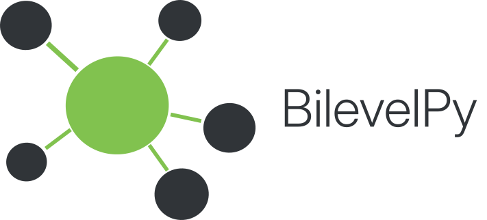

# BilevelPy

[](https://github.com/Institute-of-Transport-Logistics/bilevelpy/actions/workflows/ci.yml)
[](https://www.python.org/)
<!-- [](https://institute-of-transport-logistics.github.io/bilevelpy/) -->

<p align="center">
  
</p>

<p align="center">
  An extensible Python framework for building, solving, and evaluating
  <strong>Gurobi-based optimization models</strong>,
  with built-in support for hub-location problems.
</p>

> **Project status:** BilevelPy is currently an alpha release. Its public API may
> change while the framework is prepared for its first stable release.

## Overview

BilevelPy provides reusable abstractions for implementing optimization models
with Gurobi. Models are assembled from composable variables and constraints,
while the framework manages build ordering, dependency validation, solver
execution, and structured solution extraction.

The current release focuses on hub-location problems and includes dedicated
variables, constraints, preprocessing utilities, and CAB benchmark datasets.
The underlying model, data, and solution abstractions are designed to support
additional operations-research models in future releases.

| Component | Description |
|---|---|
| **Model framework** | Assemble Gurobi models from composable `Variable` and `Constraint` classes |
| **Dependency validation** | Validate required model components before construction |
| **Data pipeline** | Chain loaders and processors through the `DatasetBuilder` API |
| **Solution extraction** | Convert Gurobi results into structured BilevelPy datasets |
| **Hub-location toolkit** | Use built-in variables, constraints, processors, and CAB datasets |
| **Benchmarking** | Compare models and scenarios with structured result metadata |

## Installation

Install the current development version directly from GitHub:

```bash
poetry add git+https://github.com/Institute-of-Transport-Logistics/bilevelpy.git
```

**Requirements**

- Python 3.11 or newer
- Gurobi 11.0 or newer
- a valid Gurobi licence

BilevelPy is licensed separately from Gurobi. Installing BilevelPy does not
provide a licence for Gurobi Optimizer.

## Quick start: single-allocation hub location

The following example builds and solves an uncapacitated single-allocation hub
location model.

```python
from gurobipy import GRB, quicksum

from bilevelpy import (
    BaseModel,
    BaseModelSolution,
    DataCol,
    Dataset,
    ModelSolver,
    SolutionRegistry,
)
from bilevelpy.data.builder import DatasetBuilder
from bilevelpy.data.loaders import HLPLoader
from bilevelpy.data.processor import HLPNodeSelector
from bilevelpy.models.constraints import (
    AssignmentRestrictionConstraint,
    NumberOfHubsConstraint,
    SingleAllocationConstraint,
)
from bilevelpy.models.vars import AllocationVariable
```

### 1. Load data

```python
dataset = (
    DatasetBuilder()
    .pipe(HLPLoader(Dataset.CAB100))
    .pipe(HLPNodeSelector(n_nodes=10))
    .build()
)
```

### 2. Define the model

```python
@SolutionRegistry.register_for(BaseModelSolution)
class UncapacitatedHLP(BaseModel):
    def __init__(self, n_hubs, data):
        super().__init__(data)
        self.build(
            variables=[AllocationVariable],
            constraints=[
                NumberOfHubsConstraint,
                SingleAllocationConstraint,
                AssignmentRestrictionConstraint,
            ],
            n_hubs=n_hubs,
        )

    def _set_objective(self, **kwargs):
        costs = self.data[DataCol.COST_NODE_TO_NODE]
        weights = self.data[DataCol.WEIGHTS_NODE_TO_NODE]
        nodes = list(self.data[DataCol.NODE_ID].values)
        x = self.vars[AllocationVariable]
        alpha = 0.5

        objective = quicksum(
            weights[i, j]
            * x[i, k]
            * x[j, m]
            * (costs[i, k] + alpha * costs[k, m] + costs[m, j])
            for i in nodes
            for j in nodes
            for k in nodes
            for m in nodes
        )

        return objective, GRB.MINIMIZE
```

### 3. Solve

```python
model = UncapacitatedHLP(n_hubs=2, data=dataset)
solution = ModelSolver(model).solve()

print(f"Objective: {solution.solution_metadata.objective_value:.2f}")
print(f"Time:      {solution.solution_metadata.solving_time:.2f}s")
```

Call `print(solution)` for the full solution summary:

```text
==================================================
SOLUTION SUMMARY: Uncapacitated HLP
==================================================
Variables Extracted : Allocations
--------------------------------------------------
Gurobi Configuration:
  Threads     : 1
  IntFeasTol  : 1e-09
--------------------------------------------------
Solution Metadata:
  Solving Time (s)  : 0.007
  Objective Value   : 3875.96
  Is Optimal        : True
  MIP Gap (%)       : 0.0
  Nodes Explored    : 1
==================================================
```

### 4. Inspect the solution

```python
allocations = solution.solution_data[AllocationVariable]
print(allocations.to_dataframe())
```

```text
   fromnode  tonode    x
0         0       0  1.0
1         0       1  0.0
2         0       2  0.0
3         1       0  1.0
4         1       1  0.0
5         1       2  0.0
6         2       0  0.0
7         2       1  0.0
8         2       2  1.0
```

## Built-in datasets

| Dataset | Nodes | Source |
|---|---:|---|
| `Dataset.CAB25` | 25 | Civil Aeronautics Board |
| `Dataset.CAB100` | 100 | Civil Aeronautics Board |

The data layer uses:

- `EntityStore` to map tuple identifiers to scalar values
- `MultiEntityDataset` to group named entity stores
- `DatasetBuilder` to compose loaders and processors

```python
from bilevelpy import Dataset
from bilevelpy.data.builder import DatasetBuilder
from bilevelpy.data.loaders import HLPLoader
from bilevelpy.data.processor import HLPCostScaling, HLPNodeSelector

dataset = (
    DatasetBuilder()
    .pipe(HLPLoader(Dataset.CAB100))
    .pipe(HLPNodeSelector(n_nodes=15))
    .pipe(HLPCostScaling(scaling_factor=100))
    .build()
)
```

Custom processors can subclass `EntityProcessor` and implement
`process(dataset)`.

## Paper implementation

A complete research implementation built with BilevelPy is available here:

[An Oracle-based Approach for Price-setting Problems in Logistics — paper code implementation](https://institute-of-transport-logistics.github.io/oracle-price-settings-logistics)

## Documentation

| Guide | Contents |
|---|---|
| [Tutorial](https://institute-of-transport-logistics.github.io/bilevelpy/tutorial/) | Step-by-step introduction |
| [Full pipeline](https://institute-of-transport-logistics.github.io/bilevelpy/guides/full_pipeline/) | Custom variables, constraints, and model construction |
| [Datasets](https://institute-of-transport-logistics.github.io/bilevelpy/guides/datasets/) | `EntityStore`, `MultiEntityDataset`, and `DatasetBuilder` |
| [Models](https://institute-of-transport-logistics.github.io/bilevelpy/guides/models/) | Variables, constraints, and the model build lifecycle |
| [Solving](https://institute-of-transport-logistics.github.io/bilevelpy/guides/solving/) | Solver configuration and structured solution extraction |

<!--
Full documentation:
https://institute-of-transport-logistics.github.io/bilevelpy/
-->

## Licence

BilevelPy is licensed under the
[Apache License 2.0](LICENSE).

Gurobi Optimizer and `gurobipy` are proprietary software distributed and
licensed separately by Gurobi Optimization, LLC.
