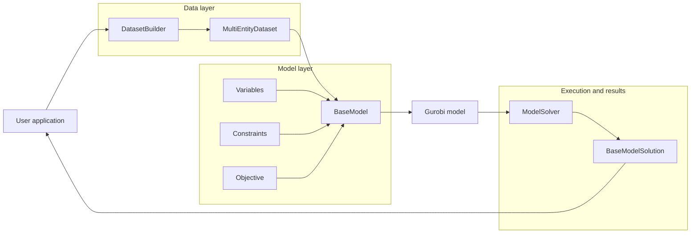

# Architecture

BilevelPy separates an optimization application into four stages:

1. prepare model data
2. construct the optimization model
3. execute the solver
4. extract a structured solution

The framework coordinates these stages while leaving the mathematical model
and domain-specific decisions under the user's control.

## System overview



## Main components

| Package | Responsibility |
|---|---|
| `bilevelpy.core` | Shared dataset and column identifiers |
| `bilevelpy.data` | Dataset storage, loading, transformation, and pipeline construction |
| `bilevelpy.models` | Model lifecycle, variables, constraints, and component metadata |
| `bilevelpy.solver` | Gurobi configuration and optimization execution |
| `bilevelpy.solution` | Structured solution data, solver metadata, and model-to-solution registration |
| `bilevelpy.benchmarks` | Experimental utilities for repeated model runs and result logging |

## Data layer

Model data is represented by two main abstractions:

- `EntityStore` maps tuple-based identifiers to scalar values.
- `MultiEntityDataset` groups multiple named entity stores.

`DatasetBuilder` creates datasets through a sequence of loaders and processors:

```python
dataset = (
    DatasetBuilder()
    .pipe(MyLoader())
    .pipe(MyProcessor())
    .build()
)
```

A loader introduces source data. A processor transforms or enriches the current
dataset. This keeps data preparation separate from mathematical model
construction.

## Model layer

A model is implemented by subclassing `BaseModel`.

The model declares:

- the variable components it requires
- the constraint components it requires
- the objective function
- model-specific configuration values

During `build()`, BilevelPy coordinates component construction and validates
declared dependencies before constraints are added.

Variables and constraints are classes rather than isolated functions. This
allows them to carry metadata, declare dependencies, and be reused across
different models.

## Solver layer

`ModelSolver` receives a constructed model and controls the Gurobi execution.

Its responsibility is limited to solver configuration and execution. It does
not define the mathematical formulation and does not prepare application data.

## Solution layer

After optimization, BilevelPy converts Gurobi results into structured solution
objects.

A solution contains:

- extracted variable values
- objective value
- solving time
- optimality information
- MIP gap
- explored node count

`SolutionRegistry` maps a model type to its corresponding solution type. Custom
models can therefore return domain-specific solution classes without changing
the solver.

## Extension points

BilevelPy is designed to be extended through focused subclasses:

| Extension point | Use it to |
|---|---|
| Loader | Read a new dataset or external data source |
| Processor | Transform, filter, scale, or enrich model data |
| `Variable` | Define a reusable decision-variable family |
| `Constraint` | Define a reusable constraint family |
| `BaseModel` | Assemble components and define an objective |
| `BaseModelSolution` | Add domain-specific solution access or presentation |

The normal extension path does not require changes to the framework core.

## Responsibility boundary

BilevelPy manages:

- data-pipeline composition
- model-component orchestration
- dependency validation
- solver execution
- structured result extraction

The user remains responsible for:

- the mathematical formulation
- the meaning and quality of input data
- selecting variables and constraints
- defining the objective
- interpreting and validating results
- obtaining and configuring a Gurobi licence

## Design principles

**Composition over monolithic models.** Variables, constraints, data
processors, and solutions are independent components.

**Explicit dependencies.** A constraint can declare which variables it needs,
allowing invalid model configurations to fail early.

**Separation of concerns.** Data preparation, mathematical modeling, solving,
and result handling remain distinct.

**Gurobi-native modeling.** BilevelPy organizes Gurobi-based models; it does not
replace Gurobi's modeling capabilities or licensing.
